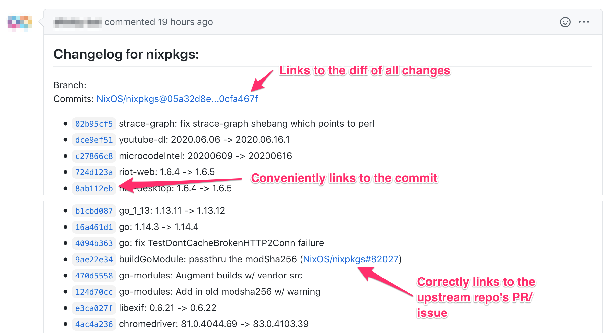

= niv-updater: Automated dependency updates with niv

image:https://github.com/knl/niv-updater-action/workflows/CI/badge.svg[CI]
image:https://img.shields.io/github/v/release/knl/niv-updater-action[GitHub release (latest by date)]

This action will open a pull request to `master` branch (or otherwise specified
branch) whenever https://github.com/nmattia/niv[niv] detects updates to
`nix/sources.json` in your repository, for each dependency separately. Each PR
will contain a beautiful Changelog of all the changes in the update, like this:

The best way to use `niv-updater-action` is to set up a scheduled workflow. This
way, whenever there are new updates, you will get a PR that you can just
approve and avoid a lot of manual work.

== Example

Here is an minimal example of what to put in your
`+.github/workflows/niv-updates.yml+` file to trigger the action.

[source,yaml]
----
name: Automated niv-managed dependency updates
on:
  schedule:
    # * is a special character in YAML so you have to quote this string
    # run this every day at 4:00am
    - cron:  '0 4 * * *'
jobs:
  niv-updater:
    name: 'Create PRs for niv-managed dependencies'
    runs-on: ubuntu-latest
    steps:
      # notice there is no checkout step
      - name: niv-updater-action
        uses: knl/niv-updater-action@v11
        env:
          GITHUB_TOKEN: ${{ secrets.GITHUB_TOKEN }}
----

== Configuration

=== Inputs

`niv-updater-action` is configured using the following inputs:

* `pull_request_base`: (Optional) The name of the branch to issue the pull request
  against. In addition, the name of the branch from which `nix/sources.json` is
  taken from as the base. Defaults to an empty string which means taking as the
  base the default branch for the repository.
* `sources_file`: (Optional) The path in the repo to the `sources.json` file.
  This value will be passed to niv via `--sources-file` option. Defaults to
  `nix/sources.json`.
* `niv_version`: (Optional) The niv version to be used. Defaults to `master`,
  meaning `niv-updater-action` will take the latest niv for each run. You may want
  to fix a particular version and avoid future breaks to your workflow. If you're
  using a self-hosted runner, set this to `*from-nixpkgs*`.
* `branch_prefix`: (Optional) The prefix used for update branches, created by
  this action. The action does not sanitize the branch name. For a description
  of what a valid branch name is, please consult:
  https://mirrors.edge.kernel.org/pub/software/scm/git/docs/git-check-ref-format.html.
  Defaults to `update/`.
* `keep_updating`: (Optional) If PR already exists, keep it updated with new
  changes. The branch will be force updated, as this process keeps a single
  commit on a branch. Defaults to `false` to maintain the old behaviour.
* `skip_versioned_revisions`: (Optional, a boolean) If `true`, will cause the
  action to skip updating any dependency that has a version in their revision.
  This is due to the way niv currently works, where it will always update to the
  latest HEAD of a branch. Thus, if one have a dependency where, for example,
  `rev=v1.0.0`, niv would normally update it to the latest head of the branch,
  making `rev` holding the appropriate SHA. This is something one would not
  normally expect. Thus, this option exists until niv fixes the behaviour.
  Defaults to `true`.
* `skip_ssh_repos`: (Optional, a boolean) If `true`, will cause the action to
  skip updating any dependency that is hosted by a repo accessible via ssh.
  Defaults to `false`.
* `whitelist`: (Optional) A list of dependencies, comma separated, that will be
  checked for updates. This list will be checked *before* the blacklist.
  Defaults to an empty string, which is a _special case_ for looking into all
  dependencies tracked by `niv`.
* `blacklist`: (Optional) A list of dependencies, comma separated, to skip from
  updating. This list will be checked *after* the whitelist. Defaults to an
  empty string, which means all dependencies will be checked for updates.
* `labels`: (Optional) A list of labels, **newline** separated, to apply to all
  created PRs. Defaults to an empty string, meaning no labels will be applied.
  The list has to be newline separated (use YAML's `|` block), as GitHub allows
  various characters in the label's name, except the newline.
* `show_merges`: (Optional, a boolean) If `true`, the changelog will contain
  merge commits listed. Otherwise, they will be skipped (however, the commits
  from the PRs/branches will shown). Defaults to `false`.
* `message_prefix`: (Optional) The text that will be put in front of the
  generated changelog. Defaults to empty.
* `message_suffix`: (Optional) The text that will be put in after the generated
  changelog. Defaults to empty.
* `title_prefix`: (Optional) The text that will be put in front of the
  generated commit title. Defaults to empty.
* `github_changelog_no_backreferences`: (Optional, a boolean) If `true`, the
  changelog will transform all issue links to links via a redirector
  (DuckDuckGo), to prevent GitHub from backreferencing the created PR in these
  issues. For more details, see
  https://github.com/knl/niv-updater-action/issues/26[Issue #26]. Defaults to
  `true`.
* `debug_output`: (Optional, a boolean) If `true`, `set -x` will be turned on
  for the updater script, outputting every step the action takes. This will show
  up in the action log, and could be useful for trying to reproduce issues
  locally. Defaults to `false`.

As the above list suggests, `niv-updater-action` is highly configurable.
The following example exposes some of the knobs, many with their default values:

[source,yaml]
----
name: Automated niv-managed dependency updates
on:
  schedule:
    # * is a special character in YAML so you have to quote this string
    # run this every day at 4:00am
    - cron:  '0 4 * * *'
jobs:
  niv-updater:
    name: 'Create PRs for niv-managed dependencies'
    runs-on: ubuntu-latest
    steps:
      # notice there is no checkout step
      - name: niv-updater-action
        uses: knl/niv-updater-action@v11
        env:
          GITHUB_TOKEN: ${{ secrets.GITHUB_TOKEN }}
        with:
          # NOTE: All inputs are optional. This list them with their default values.
          # Use the default branch for the repository
          pull_request_base: ''
          # The path in the repo to the sources.json file
          sources_file: 'nix/sources.json'
          # The niv version to use. `master` will track the latest niv.
          niv_version: 'master'
          # Keep the PR updated with new changes
          keep_updating: true
          # The prefix to add to every created branch
          branch_prefix: 'update/'
          # Update all dependencies tracked by niv. Another example: 'common,jq,hub'
          whitelist: ''
          # Do not blacklist any of the dependencies. Another example: 'nixpkgs,niv'
          blacklist: ''
          # Note that | is really important for the labels
          labels: |
            documentation
            good first issue
          # Have some prefix and a suffix. Use '|' to keep newlines
          message_prefix: |
            ## Motivation

            Dependencies should be up to date.
          message_suffix:
            Notify @myorg/myteam.
          # Have a prefix to the commit title itself, for example, to support conventional commits.
          title_prefix: refactor:
----

== Secrets

Secrets are similar to inputs except that they are encrypted and only used by
GitHub Actions. It's a convenient way to keep sensitive data out of the GitHub
Actions workflow YAML file.

* `GITHUB_TOKEN` - (Required) The GitHub API token used to create pull requests
  and get content from all repositories tracked by `niv`.

== Self hosted runner

Self-hosted runners are running with dynamic users so nix profile is not
accessible, as well as nix-env. As this action relies on nix-env to install
niv, the default configuration will not work. Thus, to use niv from available
nixpkgs, set `niv_version` to `pass:[*from-nixpkgs*]`. It will install `niv`
using `nixpkgs` with nix-shell instead of nix-env.

To avoid using `sudo` (also unavailable on self-hosted runners), the input
`pass:[skip_ssh_repos]` should be set to `true`.

Example:

[source,yaml]
----
name: Automated niv-managed dependency updates
on:
  schedule:
    # * is a special character in YAML so you have to quote this string
    # run this every day at 4:00am
    - cron:  '0 4 * * *'
jobs:
  niv-updater:
    name: 'Create PRs for niv-managed dependencies'
    runs-on: self-hosted
    steps:
      # notice there is no checkout step
      - name: niv-updater-action
        uses: knl/niv-updater-action@v11
        with:
          niv_version: '*from-nixpkgs*'
          skip_ssh_repos: true
----
